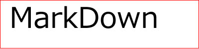

Markdown Syntax Guide
======================
# Title #

	This is an Main Title
	=====================
	This is an Sub Title
	----------------------
# Section #

* # This is an H1 #
* ## This is an H2 ##
* ### This is an H3 ##
* #### This is an H4 ####
* ##### This is an H5 #####
* ###### This is an H6 ######

# List #
	
	* 1
    
		+ 1-1

            - 1-1-1

            - 1-1-2

		+ 1-2
	* 2

	* 3

		1. 3-1

		2. 3-2
	
as:

	
* 1
	+ 1-1
		- 1-1-1
		- 1-1-2
	+ 1-2
* 2
* 3
	1. 3-1
	2. 3-2
	

# important #

* *\*em\**
*  **\*\*strong\*\***

# link #

* [This][1] is a reference-style link.

	
	\[This][1] is a reference-style link.

	[1]: http://codepongo.com/ "codepongo"

* [This](http://www.baidu.com) is a link.

	\[This](http://codepongo.com) is a link.
	
# image #

\!\[alt=markdown.jpg\](markdown.jpg)
 

# sample #

------------------------------------------------------------------------------

Mini Markdown Syntax Sample
===========================

a Mini Markdown for Writing document myself
-------------------------------------------

# Section One #

This is a Section Contents.

# Section Two #

There is a list in this section.
* 1
	+ 1-1
		- 1-1-1
		- 1-1-2
	+ 1-2
* 2
* 3
	+ 3-1
	+ 3-2

# Section Three #

there is a long long long long long long long long long long long long

long long sentence in this section.

# Section Four #

* [This][1] is a reference-style link.

* [This](http://codepongo.com) is a link.

# Section Five #

An image is shown in this section.

[Markdown zh_tw](markdown.tw)

[python markdown2](https://github.com/trentm/python-markdown2)

[Markdown syntax English](http://daringfireball.net/projects/markdown/syntax)

[1]: http://codepongo.com/ "codepongo"
